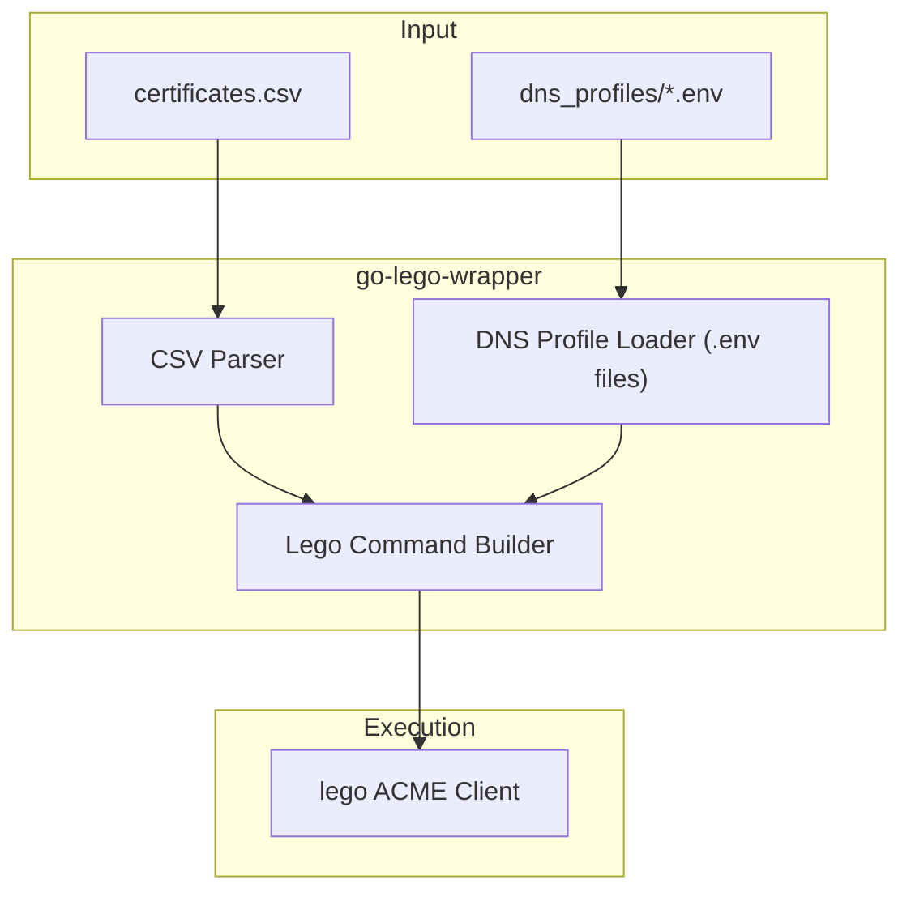

# 🔐 go-lego-wrapper


A **lightweight Go CLI tool** for batch-processing ACME certificate requests using
 the excellent [`lego`](https://go-acme.github.io/lego/) ACME client.

Instead of manually issuing certificates one at a time, this wrapper allows you to:

- define certificates in a **CSV file**
- store DNS credentials in **reusable profiles**
- automatically **generate lego commands**

The goal is to simplify issuing and renewing **multiple certificates across different DNS providers**.

------

# ✨ Features

| Feature                       | Description                                      |
| ----------------------------- | ------------------------------------------------ |
| 📄 CSV-driven workflow         | Manage many certificates in a simple spreadsheet |
| 🌐 DNS profile system          | Reuse credentials across many domains            |
| 🔐 Secure `.env` profiles      | Secrets stored outside source code               |
| ⚙️ Lego command builder        | Generates correct lego invocation automatically  |
| 📦 Embedded provider templates | Example DNS profiles generated automatically     |
| 🧠 Safe development mode       | Commands logged before execution                 |

------

# 📦 Installation

### Option 1 — Build from source

```bash
git clone https://github.com/your-org/go-lego-wrapper
cd go-lego-wrapper
go build -o lego-wrapper
```

Run:

```bash
./lego-wrapper
```

------

### Option 2 — Install with Go

```bash
go install https://github.com/dx-zone/go-lego-wrapper@latest
```

------

# 📋 Requirements

| Requirement      | Version                            |
| ---------------- | ---------------------------------- |
| Go               | **1.25+**                          |
| lego ACME client | Installed and available in `$PATH` |

Install lego:

```
go install github.com/go-acme/lego/v4/cmd/lego@latest
```

More info:

https://github.com/go-acme/lego

------

# ⚡ Quick Start

## 1️⃣ Run the tool once

```bash
go run .
```

This automatically creates a directory:

```bash
dns_profiles/
```

and generates example DNS provider templates.

------

## 2️⃣ Configure DNS profiles

Example generated files:

```bash
dns_profiles/
├── cloudflare.env
└── rfc2136.env
```

Example profile:

```bash
LEGO_DNS_PROVIDER=cloudflare
CLOUDFLARE_DNS_API_TOKEN=your-token
```

You can create custom profiles such as:

```bash
dns_profiles/production.env
dns_profiles/lab.env
dns_profiles/secondary.env
```

------

## 3️⃣ Define certificates

Create or edit:

```bash
certificates.csv
```

Example:

```csv
domain,dns_profile,email
app.example.com,production,admin@example.com
*.example.com,production,admin@example.com
vpn.example.net,secondary,admin@example.com
```

| Column        | Description                        |
| ------------- | ---------------------------------- |
| `domain`      | FQDN or wildcard domain            |
| `dns_profile` | `.env` file name without extension |
| `email`       | ACME account email                 |

------

## 4️⃣ Run the wrapper

```bash
go run .
```

Example output:

```bash
🔐 Lego ACME Wrapper

➡ Processing certificate for example.com
🚀 issuing certificate for example.com
🔧 lego command:
lego --dns cloudflare --email admin@example.com --domains example.com
```

------

# 📂 Project Structure

```bash
.
├── main.go
├── certificates.csv
├── templates/
│   ├── cloudflare-example.env
│   └── rfc2136-example.env
└── dns_profiles/          # generated automatically
```

| Path               | Description                    |
| ------------------ | ------------------------------ |
| `main.go`          | CLI entrypoint                 |
| `certificates.csv` | Certificate definitions        |
| `templates/`       | Embedded DNS profile templates |
| `dns_profiles/`    | Local environment profiles     |

------

# 🔐 Security Best Practices

Because DNS credentials are sensitive:

✔ Keep credentials only in `.env` files
 ✔ Do **not commit** `dns_profiles/`
 ✔ Do **not commit certificates or private keys**
 ✔ Use **API tokens with least privilege**

Recommended `.gitignore` entries:

```bash
dns_profiles/
*.crt
*.key
*.pem
```

------

# 🧪 Development

Run locally:

```bash
go run .
```

Format code:

```bash
gofmt -w .
```

Static analysis:

```bash
go vet ./...
```

------

# 🧠 Architecture Overview



------

# 🗺 Roadmap

Planned improvements:

-  Enable real `lego` execution
-  CLI flags (`--csv`, `--cert-path`,`--lego-path`,`--deploy-hook`, `--gpg-encryption-key`, `--gpg-decryption-key`, `--test`, `--list`, `--renew`, `--revoke`)
-  Multiple domains per certificate
-  Let's Encrypt staging support
-  Parallel certificate processing
-  Structured logging
-  Retry logic for ACME rate limits
-  Unit tests
-  GitHub release binaries

------

# 🤝 Contributing

Contributions are welcome.

Typical workflow:

```bash
git checkout -b feature/my-feature
git commit -m "Add new feature"
git push origin feature/my-feature
```

Then open a Pull Request.

------

# 📜 License

MIT License

See:

```bash
LICENSE
```

------

# ⭐ Acknowledgements

- [`lego`](https://github.com/go-acme/lego) — The ACME client powering this tool
- Let's Encrypt — Free automated TLS certificates

------

# 🧑‍💻 Author

**DX**

Sr. Cloud Services Engineer | DevOps | DNS Automation

GitHub:

```bash
https://github.com/dx-zone/go-lego-wrapper
```

---

